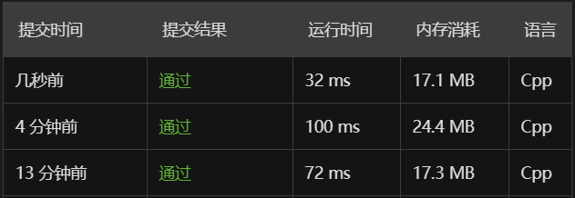

# Missing Number

## Description
Given an array containing n distinct numbers taken from 0, 1, 2, ..., n, find the one that is missing from the array.

Example 1:
```C
Input: [3,0,1]
Output: 2
```
Example 2:
```C
Input: [9,6,4,2,3,5,7,0,1]
Output: 8
Note:
Your algorithm should run in linear runtime complexity. Could you implement it using only constant extra space complexity?
```
## Solution

三种方法的性能如图所示
### 1
高斯求和法，遍历数组使用-=，最后剩下的数字就是缺失的数字
### 2
哈希集合法
### 3
排序后再做对比
## Code
### 1
```c++
int missingNumber(vector<int>& nums) {
    if(nums.empty()) return 0;
    int n = nums.size();
    int all = n*(n+1)/2;
    for(auto num : nums){
        all -= num;
    }
    return all;
}
```
### 2
```c++
int missingNumber(vector<int>& nums){
     if(nums.empty()) return 0;
     unordered_set<int> s;
     for(auto num : nums){
         s.insert(num);
     }
     for(int i = 0; i < nums.size() + 1; ++i){
         auto iter = s.find(i);
         if(iter == s.end())
             return i;
     }
     return 0;
}
```
### 3
```c++
int missingNumber(vector<int>& nums){
     if(nums.empty()) return 0;
     sort(nums.begin(), nums.end());
     if(nums.size()-1 == nums.back()) return nums.size();
     for(int i = 0; i < nums.size() + 1; ++i){
         if(nums[i] != i){
             return i;
         }
     }
     return -1;
}
```

