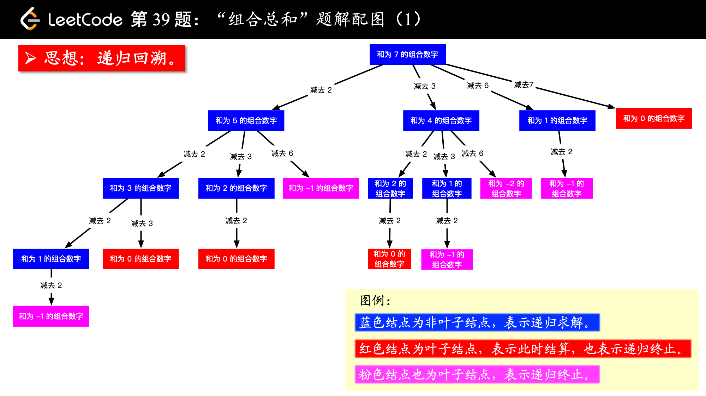

# Combination Sum

## Description
Given a set of candidate numbers (candidates) (without duplicates) and a target number (target), find all unique combinations in candidates where the candidate numbers sums to target.

The same repeated number may be chosen from candidates unlimited number of times.

Note:

All numbers (including target) will be positive integers.
The solution set must not contain duplicate combinations.
Example 1:
```c++
Input: candidates = [2,3,6,7], target = 7,
A solution set is:
[
  [7],
  [2,2,3]
]
```
Example 2:
```C++
Input: candidates = [2,3,5], target = 8,
A solution set is:
[
  [2,2,2,2],
  [2,3,3],
  [3,5]
]
```

## Solution

此题使用DFS方法解答



值得注意的是递归调用后的pop操作

## Code
```c++
class Solution {
private:
    vector<int> candidates;
public:
    vector<vector<int>> res;
    vector<int> path;
    void DFS(int subTarget, int start){
        if(subTarget == 0){
            res.push_back(path);
            return;
        }
        for(int i = start; i < candidates.size(); ++i){
            if(subTarget - candidates[i] >= 0){
                path.push_back(candidates[i]);
                DFS(subTarget - candidates[i], i);
                path.pop_back();
            }
            else
                break;
        }
    }
    vector<vector<int>> combinationSum(vector<int>& candidates, int target) {
        this->candidates = candidates;
        sort(this->candidates.begin(), this->candidates.end());
        DFS(target, 0);
        return res;
    }
};
```
