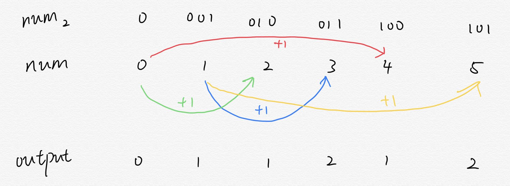

# 338.Counting Bits

## Description
Given a non negative integer number num. For every numbers i in the range 0 <= i <= num calculate the number of 1's in their binary representation and return them as an array.

Example 1:
```C
Input: 2
Output: [0,1,1]
```
Example 2:
```C
Input: 5
Output: [0,1,1,2,1,2]
```
Follow up:
- It is very easy to come up with a solution with run time O(n*sizeof(integer)). But can you do it in linear time O(n) /possibly in a single pass?
- Space complexity should be O(n).
- Can you do it like a boss? Do it without using any builtin function like __builtin_popcount in c++ or in any other language.

## Solution


例如：
- 5的二进制为101，1的二进制为01，可以看出5二进制的1的个数比1大1。即增加01的最高位并设为1，就可得到101
- 而根据5找到1的方法为：计算`int temp = log(5)/log(2);`，并取整。因此`pow(2, temp)`就是5的二进制最高位所表示的10进制的值。
- 通过计算可以得到`pow(2, temp)`为4，而5-4=1，因此5的二进制中1的值比1多1。
## Code
```c++
vector<int> countBits(int num) {
    vector<int> res(num + 1, 1);
    res[0] = 0;
    for(int i = 2; i <= num; ++i){
        int temp = log(i)/log(2);
        res[i] = res[i - pow(2, temp)] + 1;
    }
    return res;
}
```
